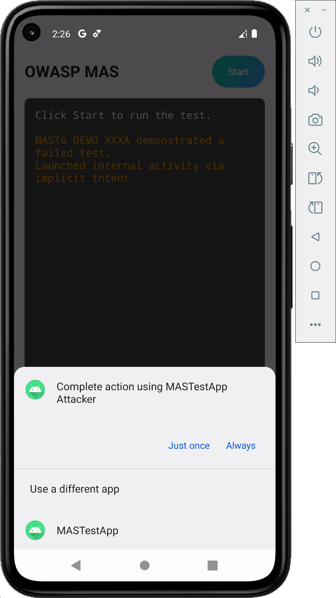

Using implicit intents for internal communication in Android applications can lead to intent hijacking. When an application sends an implicit intent, any other application on the device that registers an intent filter for the same action can intercept it.

### Vulnerability Mechanism

If a developer defines an `<intent-filter>` for an activity that is intended only for internal use, and then invokes that activity using an implicit intent, the Android system must decide which activity to start. If multiple apps handle the action, the system presents a resolver dialog (picker) to the user.

### Impact

- **Sensitive Data Exposure**: Any data passed in the intent's extras is visible to the intercepting application.
- **Phishing/UI Redressing**: An attacker can show a malicious UI to the user, potentially tricking them into providing credentials or performing unwanted actions.

### Proof of Concept (Attacker Application)

To demonstrate the interception, an attacker can create a simple application that registers for the same action.

#### Attacker Manifest
The attacker application registers for the same `INTERNAL_ACTION`.

```xml
{{ ../../../demos/android/MASVS-CODE/MASTG-DEMO-XXXA/attacker_app/AndroidManifest.xml }}
```

#### Attacker Activity
The attacker activity can then read the arguments from the intent and display them.

```kotlin
{{ ../../../demos/android/MASVS-CODE/MASTG-DEMO-XXXA/attacker_app/AttackerActivity.kt }}
```

### Observation

When the vulnerable application triggers the implicit intent, the system displays the following dialog:



If the user selects the attacker application, the malicious activity is launched instead of the intended internal activity, and it can access any sensitive data passed in the extras.
